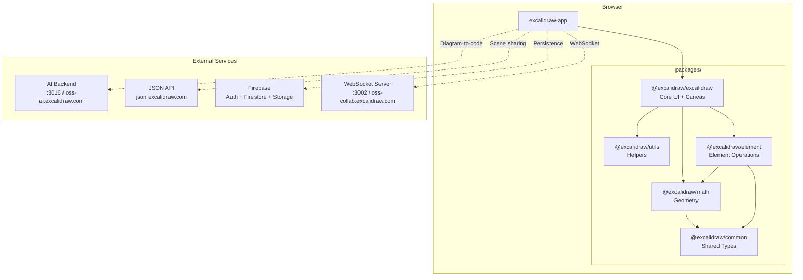
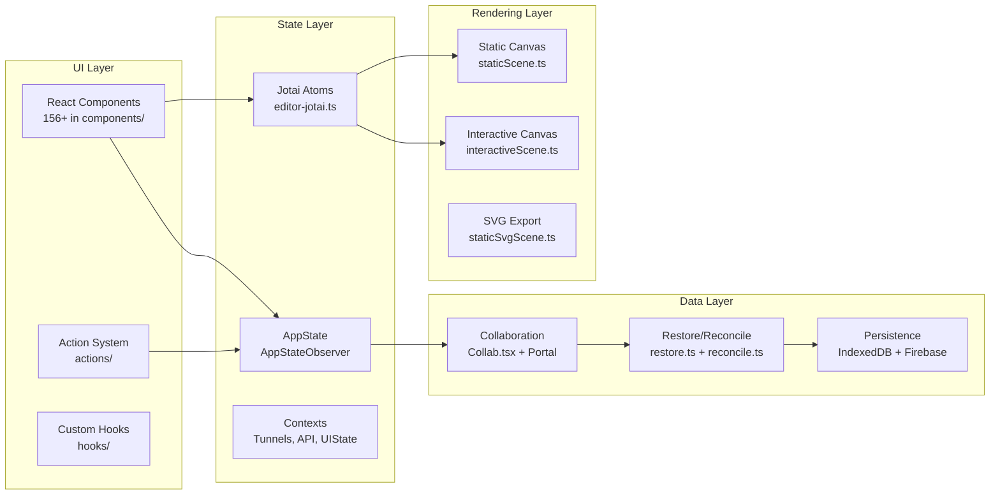

# Architecture

> High-level architecture of the Excalidraw codebase. For detailed patterns see [systemPatterns.md](../../memory-bank/systemPatterns.md).

## System Diagram



## Layer Architecture



## Key Design Principles

1. **Canvas-first**: All drawing happens on HTML Canvas (not DOM) for performance
2. **Atomic state**: Jotai atoms isolated per editor instance via `jotai-scope`
3. **Offline-first**: IndexedDB auto-save, PWA with service worker
4. **Embeddable**: Core is a publishable React component (`@excalidraw/excalidraw`)
5. **Collaboration-native**: WebSocket sync with conflict resolution built-in

## Directory Map

```
excalidraw-app/              → Web application shell
├── collab/                  → Real-time collaboration (Collab.tsx, Portal)
├── components/              → App-specific UI
├── data/                    → Firebase config, file management
└── vite.config.mts          → Build configuration

packages/excalidraw/         → Core library (555+ TS/TSX files)
├── components/              → 156+ React components
│   └── App.tsx              → Monolithic core (~407KB)
├── renderer/                → Canvas rendering pipeline
├── actions/                 → Action system (tools, transforms, clipboard)
├── data/                    → Persistence, export, reconciliation
├── hooks/                   → Custom React hooks
├── context/                 → Tunnels, contexts
├── scene/                   → Scene management
├── editor-jotai.ts          → Jotai store configuration
├── errors.ts                → Custom error hierarchy
└── types.ts                 → Core type definitions

packages/element/            → Element operations
packages/math/               → Geometry & math utilities
packages/common/             → Shared constants & types
packages/utils/              → Helper functions
```

## Related Docs
- [Dev Setup](./dev-setup.md) — onboarding guide
- [System Patterns](../memory/systemPatterns.md) — state management, rendering pipeline, collaboration flow
- [Tech Context](../memory/techContext.md) — dependencies and versions
- [Decision Log](../memory/decisionLog.md) — architectural decisions with rationale
